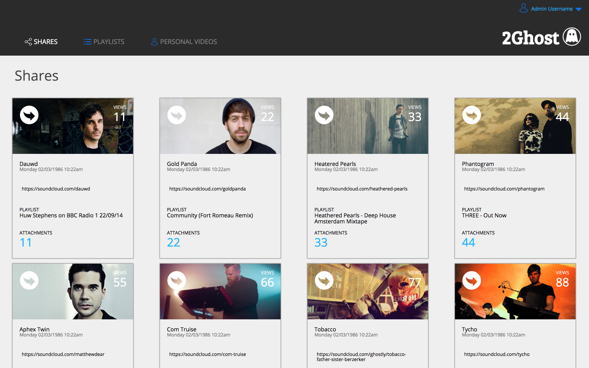

#### Static Comp Challenge 2
##### Created by Evan Miller

This static comp introduced Flexbox and Normalize.css to my workflow. The goal was to produce a site that compliments the one we are copying from and is able to fit on any device, regardless of browser type or size. I chose to use assets from the Ghostly Music Label, including artists from their label.

